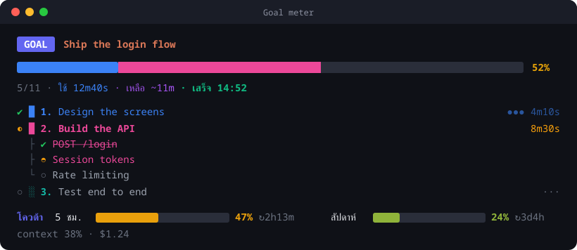

<div align="center">

# goal-meter

**Goal meter สำหรับ Claude Code** แสดงเป้าหมายใหญ่ งานหลัก งานย่อย อะไรเสร็จแล้ว อะไรกำลังทำ ใช้เวลาไปเท่าไร และจะเสร็จเมื่อไร ใน pane ข้าง session

[](https://github.com/TheerasakPing/goal-meter/actions/workflows/ci.yml)
[](https://github.com/TheerasakPing/goal-meter/tags)
[](LICENSE)

[English](README.md) · [ภาษาไทย](README.th.md)



</div>

## ความสามารถ

- **เป้าหมาย งานหลัก งานย่อย** งานที่กำลังทำจะแตกงานย่อยเป็นต้นไม้
- **สีประจำงาน** งานหลักแต่ละงานมีสีของตัวเอง ใช้ทั้งในแถวงานและในช่วงของแถบความคืบหน้า
- **แถบความคืบหน้ารวม** งานที่เสร็จเติมแถบด้วยสีของงานนั้น งานที่กำลังทำกระพริบ งานที่ยังไม่เริ่มเป็นสีเทา แถบยาวเต็มความกว้าง pane
- **เวลาและ ETA** เวลาที่ใช้ทั้งเป้าหมายและรายงาน เวลาที่เหลือ และเวลาที่คาดว่าจะเสร็จ
- **ดูสถานะได้ทันที** `✔` เสร็จ (เขียว) · `◐` กำลังทำ (เหลือง หมุน) · `○` ยังไม่ทำ (เทา) งานย่อยที่เสร็จถูกขีดฆ่า
- **โควต้าการใช้งาน** แสดงโควต้า Claude แบบ 5 ชั่วโมงและรายสัปดาห์ในบรรทัดเดียว เป็นแถบพร้อม % ที่ใช้ไปและเวลาที่จะรีเซ็ต รวมถึง context และค่าใช้จ่ายของ session แถบเปลี่ยนจากเขียวเป็นแดงเมื่อใช้มากขึ้น
- **อัปเดตเอง** Claude เรียก tool `update` ให้เองตลอดการทำงาน
- **Status line** แสดง `Goal 52% (5/11) · ETA 14:52 | 5 ชม. 47% · สัปดาห์ 24%` แม้ปิด pane

## ติดตั้ง

พิมพ์ใน Claude Code แบบ terminal:

```
/plugin install goal-meter --marketplace TheerasakPing/goal-meter
```

ตอบ `y` เพื่อเพิ่ม marketplace แล้วเลือก scope (แนะนำ `user`) ใช้งานได้ทันที

**อัปเดต** เป็นเวอร์ชันล่าสุด รันใน terminal:

```
claude plugin marketplace update goal-meter
claude plugin update goal-meter@goal-meter
```

คำสั่งแรกดึงรายการเวอร์ชันใหม่ คำสั่งที่สองอัปเดตตัวที่ติดตั้งอยู่ จากนั้นเปิด session ใหม่

## ใช้ได้ที่ไหน

| ที่ใช้ | ใช้ได้ |
| --- | --- |
| Claude Code ใน terminal | ✅ ติดตั้งและใช้ได้ |
| Claude Desktop แท็บ **Code** | ✅ ติดตั้งจาก terminal แบบ scope `user` แล้วโหลดในแอปด้วย |
| Claude Code ใน VS Code, มือถือ | น่าจะได้ (ยังไม่ได้ทดสอบ) |
| claude.ai แชต, แอป Claude แชต | ❌ ไม่รองรับ mod |

โควต้าต้องใช้ subscription (Pro/Max) และขึ้นหลัง Claude ตอบครั้งแรกใน session สร้างบน API mod แบบ early access ของ Claude Code 2.1.295

## ใช้งาน

สั่งงานหลายขั้นตอนให้ Claude ได้เลย meter จะเปิดและอัปเดตเองระหว่างทำงาน

| คำสั่ง | ทำอะไร |
| --- | --- |
| `/goal-meter` | แสดง meter เหนือช่องพิมพ์ |
| `/goal-meter <เป้าหมาย>` | ตั้งเป้าหมายเอง |
| `/goal-meter hide` | ซ่อน meter เหนือช่องพิมพ์ (status line ยังอยู่) |
| `/goal-meter pane` | เปิด meter แบบเต็มเป็น pane |
| `/goal-meter mode status` | แถบเหนือช่องพิมพ์ + status line เท่านั้น |
| `/goal-meter mode panel` | pane อย่างเดียว |
| `/goal-meter mode both` | ทั้งสองแบบ (ค่าเริ่มต้น) |
| `/goal-meter clear` | ล้างเป้าหมาย |

โหมดจะถูกจำไว้ข้าม session meter แสดงได้สูงสุด 3 ที่:

- **เหนือช่องพิมพ์** เป็นแถบ 2 บรรทัด: เป้าหมาย แถบความคืบหน้า เวลาเสร็จ งานที่กำลังทำ และโควต้า
- **status line** ข้อความบรรทัดเดียว: `Goal 52% (5/11) · ◐ Build the API · ETA 14:52 | 5 ชม. 47% · สัปดาห์ 24%`

- **pane** meter แบบเต็มทุกงานย่อย เปิดเองเมื่อเริ่มเป้าหมายในโหมด `panel` หรือ `both` หรือสั่ง `/goal-meter pane` เมื่อไรก็ได้

## ทำงานอย่างไร

- **เวลา** mod เป็นคนจับเวลาเอง เริ่มนับเมื่อเห็นงานเป็น "กำลังทำ" ครั้งแรก หยุดเมื่อเห็นเป็น "เสร็จ" ครั้งแรก
- **งานที่มีงานย่อย** สถานะตามงานย่อย: เสร็จเมื่อครบทุกตัว กำลังทำเมื่อเริ่มสักตัว
- **ความคืบหน้า** นับงานย่อยเป็นหน่วย (งานที่ไม่มีงานย่อยนับเป็น 1) เสร็จ = 1, กำลังทำ = ½
- **ETA** = เวลาที่ใช้ไป × (1 − ความคืบหน้า) ÷ ความคืบหน้า

รายละเอียด schema ของ tool และการพัฒนาดูที่ [README.md](README.md)

## License

[MIT](LICENSE) © TheerasakPing
